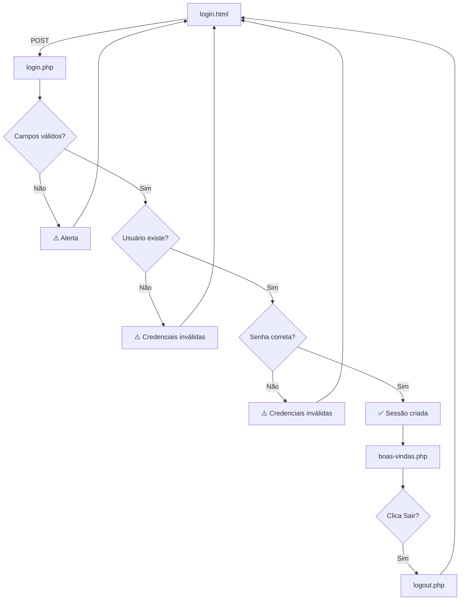

# Sistema de Login PHP

Um sistema completo de autenticação e login desenvolvido em PHP com MySQL, incluindo funcionalidades de registro, recuperação de senha e gestão de sessões seguras.

---

## 📋 Visão Geral

Este projeto implementa um sistema robusto de autenticação com as seguintes características:

- ✅ Login de usuários com validação segura
- ✅ Registro (cadastro) de novos usuários
- ✅ Recuperação de senha
- ✅ Redefinição de senha
- ✅ Proteção contra SQL Injection
- ✅ Hashing seguro de senhas
- ✅ Regeneração de ID de sessão
- ✅ Página de boas-vindas personalizada

---

## 📁 Estrutura do Projeto

```
pagina-login-php/
├── config/
│   ├── conexao.php              # Configurações de conexão com banco de dados
│   └── auth.php                 # Lógica de autenticação
├── modules/autenticacao/
│   ├── login.html               # Formulário de login
│   ├── login.php                # Processamento de login
│   ├── criar-conta.html         # Formulário de registro
│   ├── registrar.php            # Processamento de registro
│   ├── esqueci-senha.html       # Formulário de recuperação de senha
│   ├── solicitar-recuperacao.php # Processamento de recuperação
│   ├── redefinir-senha.php      # Redefinição de senha
│   ├── atualizar-senha.php      # Atualização de senha
│   ├── logout.php               # Logout do usuário
│   └── boas-vindas.php          # Página de boas-vindas após login
├── assets/css/
│   ├── login.css                # Estilos do login
│   └── criar-conta.css          # Estilos do registro
├── database/
│   └── banco.sql                # Script SQL para criar banco de dados
└── README.md                    # Este arquivo
```

---

## 🔧 Requisitos

- **PHP** 7.0 ou superior
- **MySQL** 5.7 ou superior
- **Servidor Web** (Apache, Nginx, etc.)
- **XAMPP** ou similar para desenvolvimento local

---

## ⚙️ Instalação e Configuração

### 1. Clonar ou baixar o projeto

```bash
git clone https://github.com/seu-usuario/pagina-login-php.git
cd pagina-login-php
```

### 2. Configurar o banco de dados

#### Opção A: Via phpMyAdmin (XAMPP)

1. Acesse http://localhost/phpmyadmin
2. Clique em "Nova" para criar novo banco de dados
3. Nome do banco: `Login`
4. Abra a aba "SQL" e copie o conteúdo de `database/banco.sql`
5. Cole o script e execute

#### Opção B: Via linha de comando

```bash
mysql -u root -p < database/banco.sql
```

### 3. Verificar configuração de conexão

Abra `config/conexao.php` e verifique os dados:

```php
define("HOST", "localhost");    // Host do MySQL
define("PORT", "3307");         // Porta do MySQL (padrão: 3306)
define("USER", "root");         // Usuário do MySQL
define("PAS", "");              // Senha (deixe em branco se não houver)
define("BASE", "Login");        // Nome do banco de dados
```

**Ajuste os valores conforme sua configuração do MySQL.**

### 4. Colocar no servidor

```bash
# Copiar para XAMPP (Windows)
xcopy pagina-login-php "C:\xampp\htdocs\pagina-login-php" /E /I

# Ou para Linux
cp -r pagina-login-php /var/www/html/pagina-login-php
```

---

## 🚀 Como Usar o Sistema de Login

### Acessar a página de login

1. Abra seu navegador e acesse:
   ```
   http://localhost/pagina-login-php/modules/autenticacao/login.html
   ```

2. Você verá um formulário com dois campos:
   - **E-mail**: Digite seu e-mail registrado
   - **Senha**: Digite sua senha

3. Clique no botão **"Entrar"**

### Fluxo de Login

```
login.html (Formulário)
    ↓
    ↓ POST (email, senha)
    ↓
login.php (Processamento)
    ↓
    ├─→ Valida campos vazios
    ├─→ Busca usuário no banco de dados
    ├─→ Verifica se senha está correta
    ├─→ Cria sessão do usuário
    ↓
boas-vindas.php (Página de boas-vindas)
    ↓
    └─→ Exibe "Boas-vindas!" com o nome do usuário
```

---

## 📄 Páginas do Sistema

### 1. **login.html** - Formulário de Login
- Página inicial para autenticação
- Campos: E-mail e Senha
- Links para registro e recuperação de senha

### 2. **boas-vindas.php** - Página de Boas-vindas
- Exibida após login bem-sucedido
- Mostra:
  - Mensagem "Boas-vindas!" com o nome do usuário
  - E-mail do usuário
  - Perfil do usuário (ADMIN ou OPERADOR)
  - Botão "Sair" para fazer logout

### 3. **criar-conta.html** - Formulário de Registro
- Permite criar nova conta
- Campos: Nome, E-mail, Senha

### 4. **esqueci-senha.html** - Recuperação de Senha
- Solicita e-mail para recuperação
- Envia link de redefinição

### 5. **logout.php** - Logout
- Encerra a sessão do usuário
- Redireciona para página de login

---

## 🔒 Segurança

O sistema implementa várias medidas de segurança:

| Medida | Descrição |
|--------|-----------|
| **SQL Injection** | Usa prepared statements (`bind_param`) |
| **Hashing de Senha** | `password_hash()` com algoritmo bcrypt |
| **Verificação de Senha** | `password_verify()` para comparação segura |
| **Session Fixation** | `session_regenerate_id(true)` após login |
| **Mensagens Genéricas** | Não revela se e-mail existe no banco |
| **Validação de Campos** | Verifica campos vazios |
| **Proteção de Sessão** | Verifica se usuário está autenticado |

---

## 📝 Credenciais de Teste

Após executar o script `banco.sql`, você pode usar as seguintes credenciais:

| E-mail | Senha | Perfil |
|--------|-------|--------|
| admin@example.com | Admin@123 | ADMIN |
| operador@example.com | Op123456 | OPERADOR |

**Nota:** As senhas são apenas para teste. Em produção, use senhas fortes e únicas.

---

## 🐛 Tratamento de Erros

### Login com campos vazios
- Exibe alerta: "Informe e-mail e senha"
- Retorna para página anterior

### E-mail não encontrado
- Exibe alerta: "Credenciais inválidas"
- Retorna para página anterior

### Senha incorreta
- Exibe alerta: "Credenciais inválidas"
- Retorna para página anterior

### Acesso a página protegida sem autenticação
- Redireciona para `login.html`

---

## 🔄 Fluxo Completo de Autenticação



---

## 📚 Tecnologias Utilizadas

- **PHP** 7.0+
- **MySQL** 5.7+
- **HTML5**
- **CSS3**
- **JavaScript**

---

## 🤝 Contribuindo

Para reportar bugs ou sugerir melhorias, abra uma issue no repositório.

---

## 📄 Licença

Este projeto é de código aberto e pode ser usado livremente.

---

## ❓ Dúvidas Frequentes

### P: Esqueci a senha de admin?
**R:** Acesse a página "Esqueci minha senha" em `esqueci-senha.html` e siga as instruções.

### P: Como adicionar mais usuários?
**R:** Use a página de registro em `criar-conta.html` ou insira diretamente no banco de dados.

### P: A porta do MySQL é diferente?
**R:** Modifique o valor de `PORT` em `config/conexao.php`.

### P: Como faço logout?
**R:** Clique no botão "Sair" na página de boas-vindas ou acesse `logout.php` diretamente.

---

**Desenvolvido com ❤️ em PHP**
